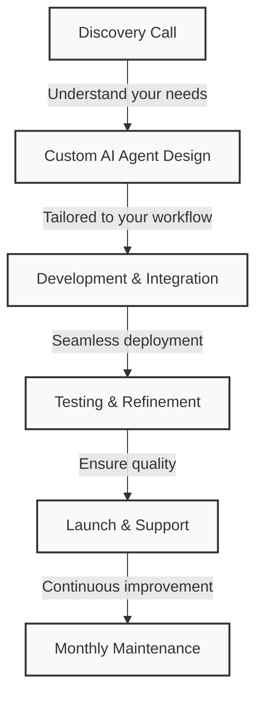

## CRAFTGEN

Your done-for-you AI agent building company. We create custom AI solutions tailored to your specific workflows, leveraging our open-source, no-code platform powered by the actor model for dynamic, graph-based implementations.

### Our Process

### How It Works

1. **Discovery Call** - We learn about your business needs and workflows
2. **Custom AI Agent Design** - We design a solution specifically for your requirements
3. **Development & Integration** - We build and integrate the AI agent into your existing systems
4. **Testing & Refinement** - We thoroughly test and refine the solution
5. **Launch & Support** - We help you deploy and provide ongoing support
6. **Monthly Maintenance** - We continuously improve your AI agent with a simple monthly fee

### Ready to Transform Your Workflow?

